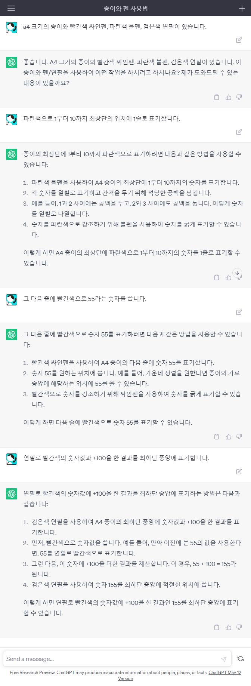
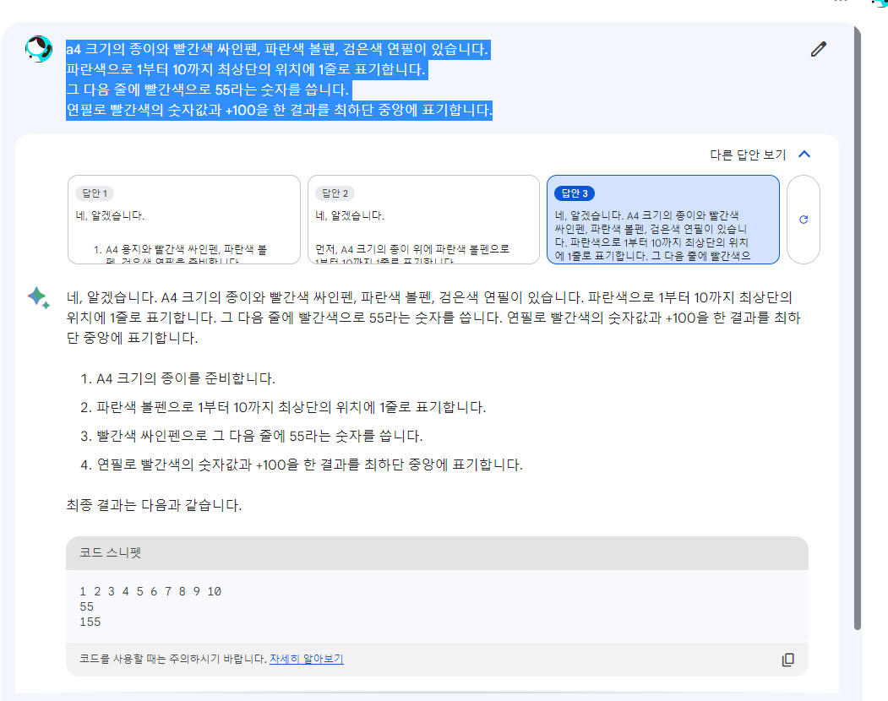

# Context형식으로 사고하기 #1

~~~
❓ a4 크기의 종이와 빨간색 싸인펜, 파란색 볼펜, 검은색 연필이 있습니다.
~~~

### ChatGPT

좋습니다. A4 크기의 종이와 빨간색 싸인펜, 파란색 볼펜, 검은색 연필이 있습니다. 이 종이와 펜/연필을 사용하여 어떤 작업을 하시려고 하시나요? 제가 도와드릴 수 있는 내용이 있을까요?

~~~
❓ 파란색으로 1부터 10까지 최상단의 위치에 1줄로 표기합니다.
~~~

### ChatGPT

종이의 최상단에 1부터 10까지 파란색으로 표기하려면 다음과 같은 방법을 사용할 수 있습니다:

1. 파란색 볼펜을 사용하여 A4 종이의 최상단에 1부터 10까지의 숫자를 표기합니다.
2. 각 숫자를 일렬로 표기하고 간격을 두기 위해 적당한 공백을 남깁니다.
3. 예를 들어, 1과 2 사이에는 공백을 두고, 2와 3 사이에도 공백을 둡니다. 이렇게 숫자를 일렬로 나열합니다.
4. 숫자를 파란색으로 강조하기 위해 볼펜을 사용하여 숫자를 굵게 표기할 수 있습니다.

이렇게 하면 A4 종이의 최상단에 파란색으로 1부터 10까지의 숫자를 1줄로 표기할 수 있습니다.

~~~
❓ 그 다음 줄에 빨간색으로 55라는 숫자를 씁니다.
~~~

### ChatGPT

그 다음 줄에 빨간색으로 숫자 55를 표기하려면 다음과 같은 방법을 사용할 수 있습니다:

1. 빨간색 싸인펜을 사용하여 A4 종이의 다음 줄에 숫자 55를 표기합니다.
2. 숫자 55를 원하는 위치에 씁니다. 예를 들어, 가운데 정렬을 원한다면 종이의 가로 중앙에 해당하는 위치에 55를 쓸 수 있습니다.
3. 빨간색으로 숫자를 강조하기 위해 싸인펜을 사용하여 숫자를 굵게 표기할 수 있습니다.

이렇게 하면 다음 줄에 빨간색으로 숫자 55를 표기할 수 있습니다.

~~~
❓ 연필로 빨간색의 숫자값과 +100을 한 결과를 최하단 중앙에 표기합니다.
~~~

### ChatGPT

연필로 빨간색의 숫자값에 +100을 한 결과를 최하단 중앙에 표기하는 방법은 다음과 같습니다:

1. 검은색 연필을 사용하여 A4 종이의 최하단 중앙에 숫자값과 +100을 한 결과를 표기합니다.
2. 먼저, 빨간색으로 숫자값을 씁니다. 예를 들어, 만약 이전에 쓴 55의 값을 사용한다면, 55를 연필로 빨간색으로 표기합니다.
3. 그런 다음, 이 숫자에 +100을 더한 결과를 계산합니다. 이 경우, 55 + 100 = 155가 됩니다.
4. 검은색 연필을 사용하여 숫자 155를 최하단 중앙에 적절한 위치에 씁니다.

이렇게 하면 연필로 빨간색의 숫자값에 +100을 한 결과인 155를 최하단 중앙에 표기할 수 있습니다.

----
#### 👨🏾‍🦳 mode prompt
> 빨간색 숫자값에 -100을 표기하고 아래에 파란색으로 같은 값을 표기해주세요

는 왜 기대값이 되지 않았을까?
----
#### ChatGPT 프롬프트 진행화면
  
> 

#### Bard에서 한 번에 프롬프트 요청한 화면
 
> 
