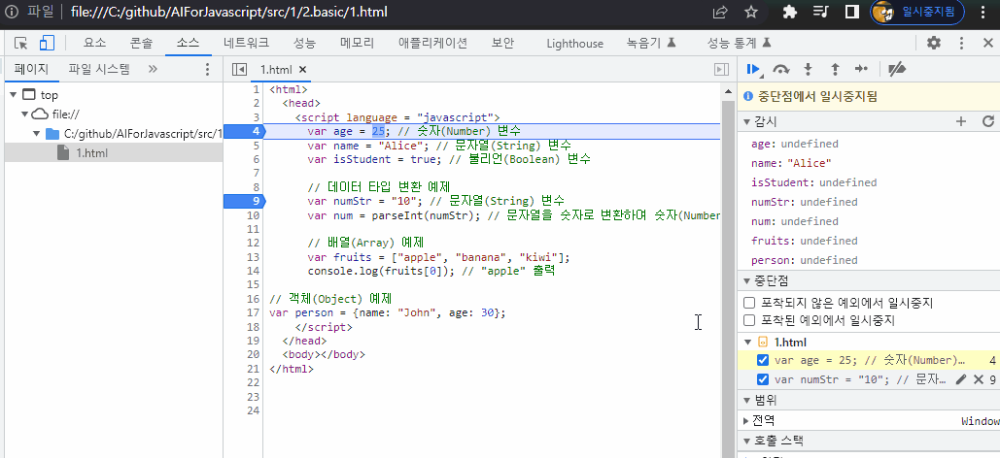
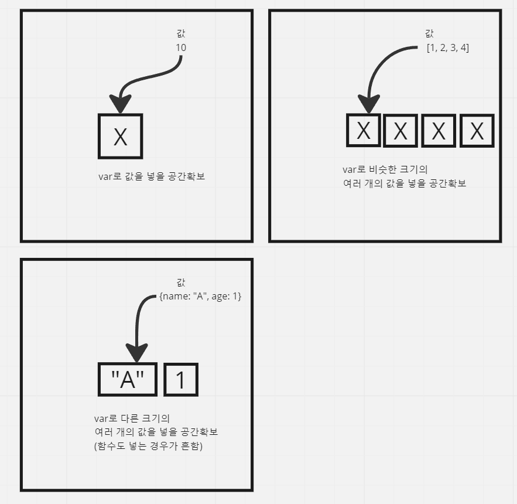
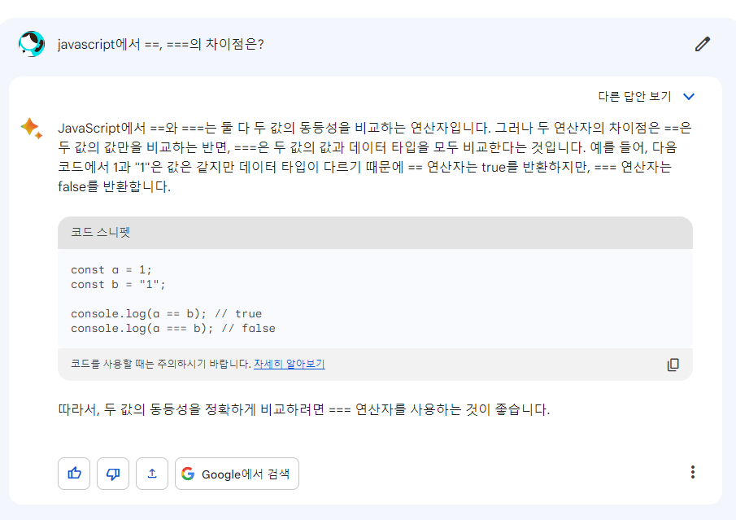

# JavaScript 프로그래밍 기초

알아두기:

#### chrome에서 javascript 디버깅 방법



----

```
❓ javascript programming의 기초를 배우려면 어떤 목차가 필요한가?
```

### ChatGPT


JavaScript 프로그래밍의 기초를 배우기 위해서는 다음과 같은 목차를 추천합니다:

1. JavaScript 소개
   - JavaScript의 역사 및 개요
   - JavaScript가 사용되는 분야

2. 기본 문법
   - 변수와 상수
   - 데이터 타입
   - 연산자
   - 조건문과 반복문
   - 함수

3. 객체 지향 프로그래밍
   - 객체와 클래스
   - 상속과 다형성

4. DOM과 이벤트 처리
   - DOM 개요
   - DOM 조작하기
   - 이벤트 핸들링

5. 비동기 처리
   - 콜백 함수
   - Promise
   - Async/Await

6. jQuery와 같은 라이브러리 사용하기
   - jQuery의 개요
   - jQuery의 기본 사용법

7. 웹 개발 프레임워크 사용하기
   - React, Angular, Vue 등의 프레임워크 개요
   - 프레임워크의 기본 사용법

이러한 항목을 차례대로 학습하면 JavaScript 프로그래밍의 기초를 충분히 배울 수 있습니다. 또한 많은 연습과 프로젝트를 통해 실력을 더욱 향상시킬 수 있습니다.

```
❓ HTML을 처음배우기 위한 목차를 알려줘
```

### ChatGPT


HTML을 처음 배우기 위한 목차를 제안해드리겠습니다:

1. HTML 소개
   - HTML이란 무엇인가?
   - HTML의 역사 및 버전

2. 기본 구조
   - HTML 문서 구조
   - 요소(element)와 태그(tag)
   - 속성(attribute)과 값(value)

3. 텍스트 요소
   - 제목 요소 (h1, h2, h3, ...)
   - 문단 요소 (p)
   - 강조 요소 (strong, em, ...)

4. 링크와 이미지
   - 하이퍼링크 (a)
   - 이미지 (img)

5. 리스트 요소
   - 순서 없는 리스트 (ul, li)
   - 순서 있는 리스트 (ol, li)

6. 테이블 요소
   - 테이블 구조 (table, tr, td)
   - 테이블 관련 요소 (th, caption, thead, tbody, tfoot)

7. 양식 요소
   - 양식 구조 (form, input, select, button)
   - 레이블 요소 (label)

8. 시맨틱 요소
   - 시맨틱 요소란?
   - 헤더 요소 (header, nav)
   - 섹션 요소 (section, article, aside)
   - 푸터 요소 (footer)

9. 웹 사이트 구조화
   - 웹 사이트를 구조화하는 방법
   - header, main, footer 요소

위의 목차를 순서대로 학습하면 HTML을 처음 배우는 데 필요한 기본적인 내용을 습득할 수 있습니다. 물론 실제로 웹 페이지를 만들어보는 것이 가장 좋은 학습 방법입니다. HTML을 사용하여 작은 웹 페이지를 만들어보면서 학습을 진행해보시기를 추천드립니다.


```
❓ JavaScript가 사용되는 분야는 어떤 것이 있나요?
```

### ChatGPT
JavaScript는 현재 웹 개발 분야에서 가장 널리 사용되는 프로그래밍 언어 중 하나입니다. 웹 개발 분야 이외에도 다양한 분야에서 JavaScript가 사용되고 있습니다. 아래는 JavaScript가 사용되는 대표적인 분야들입니다.

1. 웹 개발
   - 클라이언트 사이드 스크립트
   - 서버 사이드 스크립트(Node.js)

2. 모바일 앱 개발
   - React Native, Ionic, NativeScript 등의 프레임워크를 통해 JavaScript로 모바일 앱 개발이 가능합니다.

3. 게임 개발
   - 게임 엔진(Phaser, PixiJS, BabylonJS 등)을 통해 JavaScript로 게임을 개발할 수 있습니다.

4. 데스크톱 애플리케이션 개발
   - Electron, NW.js와 같은 프레임워크를 이용하여 JavaScript로 데스크톱 애플리케이션 개발이 가능합니다.

5. 인공지능(AI) 및 기계 학습(ML)
   - TensorFlow.js와 같은 라이브러리를 사용하여 JavaScript로 인공지능 및 기계 학습 애플리케이션을 개발할 수 있습니다.

6. IoT
   - JavaScript를 이용하여 IoT(Internet of Things) 디바이스를 제어할 수 있습니다.

JavaScript는 이 외에도 다양한 분야에서 사용되고 있으며, 빠르게 발전하고 있는 언어 중 하나입니다.


```
❓ javascript 필수기초 문법은 무엇이 있나요?
```

### ChatGPT
JavaScript 필수기초 문법에는 다음과 같은 내용이 포함됩니다.

1. 변수와 데이터 타입
   - 변수 선언: `var`, `let`, `const`
   - 데이터 타입: 숫자(Number), 문자열(String), 불리언(Boolean), null, undefined, 객체(Object)

2. 연산자
   - 산술 연산자: `+`, `-`, `*`, `/`, `%`
   - 비교 연산자: `==`, `===`, `!=`, `!==`, `<`, `>`, `<=`, `>=`
   - 논리 연산자: `&&`, `||`, `!`
   - 대입 연산자: `=`, `+=`, `-=`, `*=`, `/=`, `%=`

3. 조건문과 반복문
   - if문, else if문, else문
   - switch문
   - for문, while문, do-while문

4. 함수
   - 함수 선언: `function`
   - 함수 호출
   - 함수 매개변수와 반환값

5. 객체와 배열
   - 객체: 프로퍼티(property)와 메서드(method)로 이루어진 데이터 타입
   - 배열: 여러 개의 데이터를 저장할 수 있는 데이터 타입

6. DOM(Document Object Model)
   - HTML 문서의 요소들을 JavaScript에서 조작하기 위한 객체 모델
   - document 객체, element 객체, event 객체 등

7. 이벤트 처리
   - 이벤트: 사용자의 행동에 따라 발생하는 상황(클릭, 마우스 오버, 키보드 입력 등)
   - 이벤트 핸들러: 이벤트가 발생했을 때 실행되는 함수

이러한 JavaScript의 필수기초 문법을 알고 있다면, 기본적인 JavaScript 프로그래밍을 할 수 있게 됩니다.

```
❓ javascript에서 변수와 데이터 타입을 설명해주고 예제를 알려줘
```

### ChatGPT
JavaScript에서 변수와 데이터 타입은 프로그래밍에서 중요한 개념 중 하나입니다. 변수는 데이터를 저장하기 위한 메모리 공간이고, 데이터 타입은 변수가 저장할 수 있는 값의 종류를 나타냅니다. 

변수 선언은 `var`, `let`, `const` 키워드를 사용합니다. `var`은 변수를 선언하는 예전 방식이며, `let`과 `const`는 ES6부터 추가된 새로운 변수 선언 방식입니다. `let`은 값을 변경할 수 있는 변수를 선언할 때, `const`는 값을 변경할 수 없는 상수를 선언할 때 사용합니다.

다음은 JavaScript에서 사용할 수 있는 데이터 타입입니다.

- 숫자(Number): 정수와 실수를 모두 나타낼 수 있습니다. 예시: `var num = 10;`
- 문자열(String): 문자의 집합입니다. 예시: `var str = "Hello, World!";`
- 불리언(Boolean): `true`와 `false` 값만 가질 수 있습니다. 예시: `var flag = true;`
- null: 값이 없음을 나타냅니다. 예시: `var nullVar = null;`
- undefined: 값이 할당되지 않은 상태입니다. 예시: `var undefinedVar;`
- 객체(Object): 여러 속성을 가지는 데이터 타입입니다. 예시: `var person = {name: "John", age: 30};`
- 배열(Array): 여러 값을 저장하는 데이터 타입입니다. 예시: `var fruits = ["apple", "banana", "kiwi"];`

아래는 변수와 데이터 타입을 사용한 예제입니다. 

```javascript
// 변수 선언 예제
var age = 25; // 숫자(Number) 변수
var name = "Alice"; // 문자열(String) 변수
var isStudent = true; // 불리언(Boolean) 변수

// 데이터 타입 변환 예제
var numStr = "10"; // 문자열(String) 변수
var num = parseInt(numStr); // 문자열을 숫자로 변환하여 숫자(Number) 변수에 저장

// 배열(Array) 예제
var fruits = ["apple", "banana", "kiwi"];
console.log(fruits[0]); // "apple" 출력

// 객체(Object) 예제
var person = {name: "John", age: 30};
console.log(person.name); // "John" 출력
```

위 예제에서 `console.log()` 함수는 콘솔에 출력하는 함수입니다. 이를 통해 변수의 값을 확인할 수 있습니다.

#### (●'◡'●) 변수설명


```
❓ javascript에서 연산자 사용법을 알려주고 예제를 보여주세요
```

### ChatGPT
JavaScript에서는 다양한 종류의 연산자를 사용할 수 있습니다. 연산자는 값을 연산하거나 조건을 판단하는 데 사용됩니다. 아래는 JavaScript에서 주로 사용되는 연산자들과 예제입니다.

1. 산술 연산자
   - 더하기: `+`
   - 빼기: `-`
   - 곱하기: `*`
   - 나누기: `/`
   - 나머지: `%`

```javascript
var num1 = 10;
var num2 = 5;

var sum = num1 + num2; // 10 + 5 = 15
var difference = num1 - num2; // 10 - 5 = 5
var product = num1 * num2; // 10 * 5 = 50
var quotient = num1 / num2; // 10 / 5 = 2
var remainder = num1 % num2; // 10 % 5 = 0
```

2. 할당 연산자
   - 변수에 값을 할당하는 연산자
   - `=`, `+=`, `-=`, `*=`, `/=`, `%=`

```javascript
var x = 10;
x += 5; // x = x + 5, 10 + 5 = 15

var y = 20;
y -= 3; // y = y - 3, 20 - 3 = 17
```

3. 비교 연산자
   - 두 값을 비교하여 논리적인 결과(`true` 또는 `false`)를 반환하는 연산자
   - `==`, `===`, `!=`, `!==`, `<`, `>`, `<=`, `>=`

```javascript
var a = 10;
var b = 5;

console.log(a == b); // false
console.log(a === b); // false
console.log(a != b); // true
console.log(a !== b); // true
console.log(a < b); // false
console.log(a > b); // true
console.log(a <= b); // false
console.log(a >= b); // true
```

4. 논리 연산자
   - 논리 연산을 수행하여 논리적인 결과(`true` 또는 `false`)를 반환하는 연산자
   - `&&` (논리 AND), `||` (논리 OR), `!` (논리 NOT)

```javascript
var x = 10;
var y = 5;
var z = 3;

console.log(x > y && y > z); // true
console.log(x > y || y < z); // true
console.log(!(x > y)); // false
```

5. 문자열 연결 연산자
   - 문자열을 이어붙이는 연산자
   - `+`

```javascript
var firstName = "John";
var lastName = "Doe";

var fullName = firstName + " " + lastName; // "John Doe"
```

JavaScript에서 사용되는 연산자는 이 외에도 많이 있습니다. 위 예제들은 주요한 연산자를 다룬 것이므로, 이를 참고하여 JavaScript에서 연산자를 사용할 수 있습니다.

#### (●'◡'●) ==와 === 차이점


```
❓ javascript에서 조건문을 설명해주고 예제를 보여주세요
```

### ChatGPT
JavaScript에서 조건문은 특정 조건이 참인 경우에만 특정 코드 블록을 실행하도록 제어하는 데 사용됩니다. 주로 `if`, `else if`, `else` 키워드와 함께 사용됩니다. 아래는 JavaScript에서 사용되는 조건문의 종류와 예제입니다.

1. `if` 문
   - 주어진 조건이 참인 경우에 코드 블록을 실행합니다.

```javascript
var num = 10;

if (num > 0) {
  console.log("양수입니다.");
}
```

2. `if`-`else` 문
   - 주어진 조건이 참인 경우에는 `if` 블록을, 거짓인 경우에는 `else` 블록을 실행합니다.

```javascript
var num = -5;

if (num > 0) {
  console.log("양수입니다.");
} else {
  console.log("음수입니다.");
}
```

3. `if`-`else if`-`else` 문
   - 여러 개의 조건을 검사하여 해당하는 첫 번째 조건의 코드 블록을 실행합니다.

```javascript
var num = 0;

if (num > 0) {
  console.log("양수입니다.");
} else if (num < 0) {
  console.log("음수입니다.");
} else {
  console.log("0입니다.");
}
```

4. 중첩된 `if` 문
   - `if` 문 안에 또 다른 `if` 문을 중첩하여 사용할 수 있습니다.

```javascript
var num = 10;

if (num > 0) {
  if (num % 2 === 0) {
    console.log("양수이면서 짝수입니다.");
  } else {
    console.log("양수이지만 홀수입니다.");
  }
}
```

5. 조건 연산자 (Ternary operator)
   - 간단한 조건문을 한 줄로 표현할 수 있는 연산자입니다. 조건이 참이면 첫 번째 값이 반환되고, 거짓이면 두 번째 값이 반환됩니다.

```javascript
var num = 5;
var result = num > 0 ? "양수입니다." : "음수입니다.";

console.log(result);
```

조건문을 사용하면 프로그램이 특정 조건에 따라 다른 동작을 하도록 제어할 수 있습니다. 조건문은 프로그램의 유연성과 다양한 상황에 대응하는 데 중요한 역할을 합니다.
User
javascript에서 switch 문과 반복문을 설명해주고 예제를 보여주세요
ChatGPT
JavaScript에서는 `switch` 문과 반복문을 사용하여 프로그램의 흐름을 제어하고 반복 작업을 수행할 수 있습니다. 아래에 각각의 설명과 예제를 제시합니다.

1. `switch` 문
   - 특정 값에 따라 다른 동작을 수행할 때 사용합니다. 조건이 많을 경우에 유용합니다.

```javascript
var fruit = "apple";

switch (fruit) {
  case "apple":
    console.log("사과입니다.");
    break;
  case "banana":
    console.log("바나나입니다.");
    break;
  case "kiwi":
    console.log("키위입니다.");
    break;
  default:
    console.log("기타 과일입니다.");
}
```

2. 반복문
   - 동일한 작업을 반복적으로 수행할 때 사용합니다. 주로 `for` 문과 `while` 문이 사용됩니다.

- `for` 문: 지정된 횟수만큼 반복 실행합니다.

```javascript
for (var i = 0; i < 5; i++) {
  console.log(i);
}
```

```
❓ javascript에서 객체에 대해 쉽게 설명해주세요
```

ChatGPT
JavaScript에서 객체(Object)는 프로퍼티(Property)와 메서드(Method)로 구성된 데이터 타입입니다. 객체는 현실 세계의 실체를 모델링하고 표현하기 위해 사용됩니다.

객체는 중괄호 `{}`를 사용하여 생성하며, 프로퍼티와 메서드를 포함할 수 있습니다. 프로퍼티는 객체의 상태나 특성을 나타내는 변수와 비슷한 역할을 하고, 메서드는 객체가 수행할 수 있는 동작이나 함수와 비슷한 역할을 합니다.

예를 들어, "사람"이라는 객체를 생성해보겠습니다.

```javascript
var person = {
  name: "John", // 문자열 프로퍼티
  age: 30, // 숫자 프로퍼티
  isStudent: false, // 불리언 프로퍼티
  greet: function() { // 메서드
    console.log("안녕하세요!");
  }
};
```

위의 예제에서 `person` 객체는 `name`, `age`, `isStudent`, `greet`라는 프로퍼티를 가지고 있습니다. `name`은 문자열, `age`는 숫자, `isStudent`는 불리언 값을 가지며, `greet`는 `function`을 값으로 가지는 메서드입니다.

객체의 프로퍼티와 메서드는 점(`.`) 또는 대괄호(`[]`)를 사용하여 접근할 수 있습니다. 예를 들어, `person` 객체의 `name` 프로퍼티를 출력하려면 다음과 같이 할 수 있습니다.

```javascript
console.log(person.name); // "John"
```

또는,

```javascript
console.log(person["name"]); // "John"
```

객체는 동적으로 프로퍼티를 추가하거나 변경할 수 있습니다.

```javascript
person.gender = "Male"; // 새로운 프로퍼티 추가
person.age = 31; // 프로퍼티 값 변경

console.log(person.gender); // "Male"
console.log(person.age); // 31
```

객체는 JavaScript에서 많은 기능을 제공하며, 다른 객체와의 상호작용, 데이터의 구조화 및 조작, 데이터 관리 등에 사용됩니다. 객체는 프로그래밍에서 중요한 개념이므로 JavaScript를 배울 때 꼭 알아두어야 합니다.
User
javascript에서 배열에 대해 쉽게 설명해주세요
ChatGPT
JavaScript에서 배열(Array)은 여러 개의 값을 순서대로 저장하는 데이터 구조입니다. 배열은 인덱스를 사용하여 각 요소에 접근할 수 있으며, 동일한 타입이나 다른 타입의 값을 포함할 수 있습니다.

배열은 대괄호 `[]`를 사용하여 생성하며, 각 요소는 쉼표로 구분됩니다. 예를 들어, 1부터 5까지의 숫자로 이루어진 배열을 생성해보겠습니다.

```javascript
var numbers = [1, 2, 3, 4, 5];
```

위의 예제에서 `numbers` 배열은 1부터 5까지의 숫자를 포함하고 있습니다. 각 요소는 인덱스를 사용하여 접근할 수 있습니다. 인덱스는 0부터 시작하여 요소의 위치를 나타냅니다. 예를 들어, `numbers` 배열의 첫 번째 요소에 접근하려면 다음과 같이 할 수 있습니다.

```javascript
console.log(numbers[0]); // 1
```

배열의 요소에 접근하거나 값을 변경할 때는 인덱스를 사용합니다. 배열의 길이는 `length` 프로퍼티를 통해 확인할 수 있습니다.

```javascript
console.log(numbers.length); // 5

numbers[3] = 10; // 배열의 네 번째 요소 값을 변경
console.log(numbers[3]); // 10
```

배열에는 다양한 내장 함수(methods)가 있어 배열을 다루는 작업을 더욱 편리하게 할 수 있습니다. 몇 가지 일반적인 배열 메서드의 예시를 보여드리겠습니다.

- `push()`: 배열의 끝에 새로운 요소를 추가합니다.
```javascript
numbers.push(6);
console.log(numbers); // [1, 2, 3, 10, 5, 6]
```

- `pop()`: 배열의 마지막 요소를 제거하고 반환합니다.
```javascript
var lastElement = numbers.pop();
console.log(lastElement); // 6
console.log(numbers); // [1, 2, 3, 10, 5]
```

- `indexOf()`: 지정된 요소의 인덱스를 반환합니다.
```javascript
var index = numbers.indexOf(10);
console.log(index); // 3
```

배열은 데이터를 그룹화하고 다루기 위해 유용한 데이터 구조입니다. JavaScript에서 배열은 다양한 상황에서 사용되며, 데이터의 저장, 조작, 반복 처리 등에 활용됩니다.